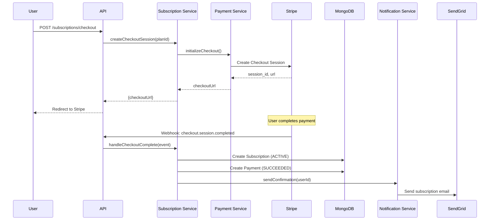
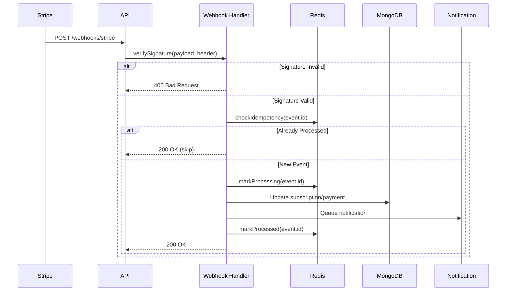
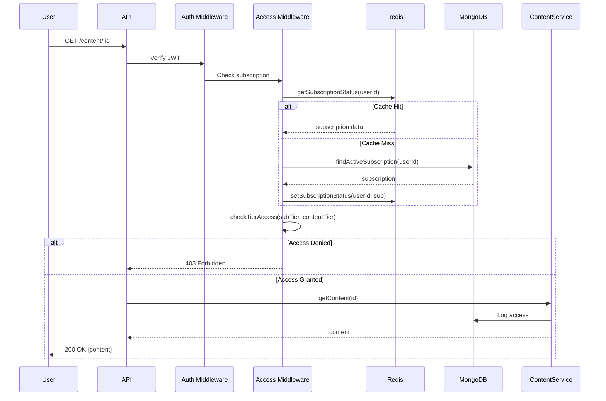

# SubsFlow Backend - System Architecture Design

**Document Version:** 1.0  
**Last Updated:** 2026-01-13  
**Status:** Approved

---

## Architecture Overview

SubsFlow uses a **layered architecture** with clear separation of concerns, designed for horizontal scaling and high availability.

```
┌─────────────────────────────────────────────────────────────────┐
│                        PRESENTATION LAYER                       │
│  ┌────────────────────┐  ┌────────────────────────────────────┐ │
│  │   REST API Routes  │  │   Webhook Handlers (Stripe/SG)    │ │
│  └────────────────────┘  └────────────────────────────────────┘ │
├─────────────────────────────────────────────────────────────────┤
│                       BUSINESS LOGIC LAYER                      │
│  ┌─────────┐ ┌─────────────┐ ┌─────────┐ ┌───────────────────┐ │
│  │  Auth   │ │ Subscription│ │ Payment │ │    Notification   │ │
│  │ Service │ │   Service   │ │ Service │ │      Service      │ │
│  └─────────┘ └─────────────┘ └─────────┘ └───────────────────┘ │
│  ┌─────────────────┐ ┌───────────────────────────────────────┐ │
│  │ Content Service │ │          Analytics Service            │ │
│  └─────────────────┘ └───────────────────────────────────────┘ │
├─────────────────────────────────────────────────────────────────┤
│                        DATA ACCESS LAYER                        │
│  ┌─────────────────────────┐  ┌────────────────────────────────┐│
│  │   Repository Pattern    │  │       Cache Manager            ││
│  │   (Mongoose Models)     │  │      (Redis Client)            ││
│  └─────────────────────────┘  └────────────────────────────────┘│
├─────────────────────────────────────────────────────────────────┤
│                       INTEGRATION LAYER                         │
│  ┌─────────────┐  ┌──────────────┐  ┌────────────────────────┐ │
│  │Stripe Client│  │SendGrid Client│ │   Job Queue (Bull)    │ │
│  └─────────────┘  └──────────────┘  └────────────────────────┘ │
├─────────────────────────────────────────────────────────────────┤
│                         DATA STORES                             │
│  ┌─────────────────────────┐  ┌────────────────────────────────┐│
│  │   MongoDB (Replica Set) │  │    Redis (Master + Replica)   ││
│  └─────────────────────────┘  └────────────────────────────────┘│
└─────────────────────────────────────────────────────────────────┘
```

---

## Directory Structure

```
src/
├── config/                 # Configuration management
│   ├── database.ts         # MongoDB connection
│   ├── redis.ts            # Redis connection
│   ├── stripe.ts           # Stripe client config
│   └── sendgrid.ts         # SendGrid client config
│
├── api/                    # Presentation Layer
│   ├── routes/             # Express route definitions
│   │   ├── auth.routes.ts
│   │   ├── subscription.routes.ts
│   │   ├── payment.routes.ts
│   │   ├── content.routes.ts
│   │   └── admin.routes.ts
│   ├── middlewares/        # Request processing
│   │   ├── auth.middleware.ts
│   │   ├── validation.middleware.ts
│   │   ├── rateLimit.middleware.ts
│   │   └── errorHandler.middleware.ts
│   └── webhooks/           # External service webhooks
│       ├── stripe.webhook.ts
│       └── sendgrid.webhook.ts
│
├── services/               # Business Logic Layer
│   ├── auth.service.ts
│   ├── subscription.service.ts
│   ├── payment.service.ts
│   ├── content.service.ts
│   ├── notification.service.ts
│   └── analytics.service.ts
│
├── repositories/           # Data Access Layer
│   ├── user.repository.ts
│   ├── subscription.repository.ts
│   ├── payment.repository.ts
│   └── content.repository.ts
│
├── models/                 # Mongoose schemas
│   ├── user.model.ts
│   ├── subscription.model.ts
│   ├── plan.model.ts
│   ├── payment.model.ts
│   ├── content.model.ts
│   └── notification.model.ts
│
├── jobs/                   # Background job processors
│   ├── queue.ts            # Bull queue setup
│   ├── subscription-sync.job.ts
│   ├── renewal-reminder.job.ts
│   └── analytics-aggregation.job.ts
│
├── utils/                  # Shared utilities
│   ├── logger.ts
│   ├── errors.ts
│   └── helpers.ts
│
└── types/                  # TypeScript definitions
    └── index.ts
```

---

## Data Flow Diagrams

### Subscription Purchase Flow



### Webhook Processing Flow



### Content Access Flow



---

## Security Architecture

### Authentication Flow

```
┌─────────────────────────────────────────────────────────────────┐
│                      AUTHENTICATION FLOW                        │
├─────────────────────────────────────────────────────────────────┤
│                                                                 │
│  1. User Login                                                  │
│     ┌──────────┐    ┌──────────┐    ┌──────────┐              │
│     │  Client  │───▶│   API    │───▶│  bcrypt  │              │
│     │          │    │          │    │ compare  │              │
│     └──────────┘    └──────────┘    └──────────┘              │
│                                          │                      │
│  2. Token Generation                     ▼                      │
│     ┌──────────────────────────────────────────────────────┐   │
│     │  JWT Payload: { userId, role, subscriptionStatus }   │   │
│     │  Access Token: 15 min expiry                         │   │
│     │  Refresh Token: 7 days expiry (stored in Redis)      │   │
│     └──────────────────────────────────────────────────────┘   │
│                                                                 │
│  3. Request Authentication                                      │
│     ┌──────────┐    ┌──────────┐    ┌──────────┐              │
│     │ Request  │───▶│   Auth   │───▶│  Verify  │              │
│     │ Header   │    │Middleware│    │   JWT    │              │
│     └──────────┘    └──────────┘    └──────────┘              │
│                                                                 │
└─────────────────────────────────────────────────────────────────┘
```

### Authorization (RBAC)

| Role | Permissions |
|------|-------------|
| **subscriber** | View plans, manage own subscription, access content per tier |
| **content_manager** | All subscriber permissions + create/edit content |
| **admin** | All permissions + user management, refunds, system settings |

### Security Headers

```typescript
// Helmet.js configuration
helmet({
  contentSecurityPolicy: {
    directives: {
      defaultSrc: ["'self'"],
      scriptSrc: ["'self'", "js.stripe.com"],
      frameSrc: ["'self'", "js.stripe.com"],
    }
  },
  hsts: { maxAge: 31536000, includeSubDomains: true },
  noSniff: true,
  xssFilter: true,
  referrerPolicy: { policy: "strict-origin-when-cross-origin" }
});
```

---

## Scaling Strategy

### Horizontal Scaling

```
                    ┌─────────────────┐
                    │   Load Balancer │
                    │   (nginx/ALB)   │
                    └────────┬────────┘
                             │
       ┌─────────────┬───────┴───────┬─────────────┐
       │             │               │             │
  ┌────▼────┐  ┌────▼────┐    ┌────▼────┐  ┌────▼────┐
  │  App 1  │  │  App 2  │    │  App 3  │  │  App N  │
  │ (Node)  │  │ (Node)  │    │ (Node)  │  │ (Node)  │
  └────┬────┘  └────┬────┘    └────┬────┘  └────┬────┘
       │             │               │             │
       └──────┬──────┴───────┬──────┴──────┬──────┘
              │              │              │
    ┌─────────▼─────────┐ ┌──▼───────────┐ ┌▼──────────┐
    │ MongoDB Replica   │ │ Redis Cluster│ │Job Workers│
    │    Primary        │ │    Primary   │ │  (Bull)   │
    │    Secondary      │ │    Replica   │ │           │
    │    Secondary      │ │              │ │           │
    └───────────────────┘ └──────────────┘ └───────────┘
```

### Stateless Design Principles

1. **No server-side sessions**: JWT + Redis for session data
2. **Externalized configuration**: Environment variables
3. **Shared nothing**: Each instance independent
4. **Idempotent operations**: Safe retries

---

## Error Handling Strategy

### Error Classification

| Error Type | HTTP Code | Example | User Message |
|------------|-----------|---------|--------------|
| ValidationError | 400 | Invalid email format | "Please provide a valid email" |
| AuthenticationError | 401 | Invalid credentials | "Invalid email or password" |
| AuthorizationError | 403 | Insufficient tier | "Upgrade your plan to access" |
| NotFoundError | 404 | Content not found | "Content not found" |
| ConflictError | 409 | Duplicate email | "Email already registered" |
| RateLimitError | 429 | Too many requests | "Too many requests, try later" |
| PaymentError | 402 | Card declined | "Payment failed: Card declined" |
| ServerError | 500 | Unexpected error | "Something went wrong" |

### Error Response Format

```json
{
  "success": false,
  "error": {
    "code": "SUBSCRIPTION_NOT_FOUND",
    "message": "No active subscription found",
    "details": null
  },
  "requestId": "req_abc123xyz"
}
```

---

## Monitoring & Observability

### Health Check Endpoints

| Endpoint | Purpose | Response |
|----------|---------|----------|
| `/health` | Basic liveness | `200 OK` |
| `/health/ready` | Full readiness | DB + Redis + Stripe checks |

### Key Metrics

| Category | Metrics |
|----------|---------|
| **Availability** | Uptime %, error rate, latency (p50/p95/p99) |
| **Business** | MRR, active subscriptions, churn rate |
| **Infrastructure** | CPU, memory, DB connections, queue depth |

### Logging Strategy

```typescript
// Correlation ID for request tracing
const requestLogger = (req, res, next) => {
  req.requestId = uuid();
  logger.info({
    requestId: req.requestId,
    method: req.method,
    path: req.path,
    userId: req.user?.id
  });
  next();
};
```

---

## Configuration Management

### Environment Variables

| Variable | Description | Example |
|----------|-------------|---------|
| `NODE_ENV` | Environment | `production` |
| `PORT` | Server port | `3000` |
| `MONGODB_URI` | Database connection | `mongodb://...` |
| `REDIS_URL` | Redis connection | `redis://...` |
| `STRIPE_SECRET_KEY` | Stripe API key | `sk_live_...` |
| `STRIPE_WEBHOOK_SECRET` | Webhook signing | `whsec_...` |
| `SENDGRID_API_KEY` | SendGrid API key | `SG.xxx...` |
| `JWT_SECRET` | Token signing | `random-secret` |
| `JWT_EXPIRY` | Token expiration | `15m` |

---

## Document History

| Version | Date | Author | Changes |
|---------|------|--------|---------|
| 1.0 | 2026-01-13 | Backend Team | Initial release |
